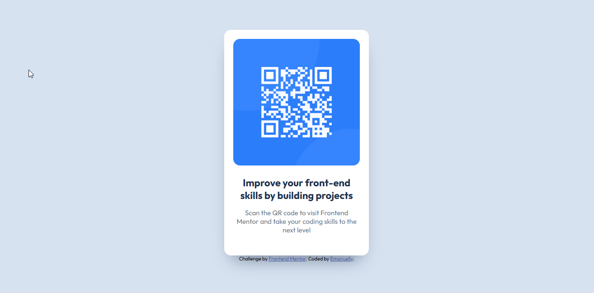

# Frontend Mentor - QR code component solution

This is a solution to the [QR code component challenge on Frontend Mentor](https://www.frontendmentor.io/challenges/qr-code-component-iux_sIO_H). Frontend Mentor challenges help you improve your coding skills by building realistic projects. 

## Table of contents

  - [Screenshot](#screenshot)
  - [Links](#links)
- [My process](#my-process)
  - [Built with](#built-with)
  - [What I learned](#what-i-learned)
  - [Continued development](#continued-development)
  - [Useful resources](#useful-resources)
- [Author](#author)
- [Acknowledgments](#acknowledgments)


### Screenshot




### Links

- Solution URL: [Add solution URL here]([https://your-solution-url.com](https://heroic-bombolone-48258e.netlify.app/)

## My process

### Built with

- Semantic HTML5 markup
- CSS custom properties
- Flexbox
- Mobile-first workflow

### What I learned

While working on this project, I learned a lot and tried to apply some new techniques that I'm proud of. Some of the highlights include:

#### 1. Using semantic `<div>` structure properly
I made sure to structure my card and attribution sections neatly, which helped me organize the layout better.  

```html
<div class="card">
  
  <h1>Improve your front-end skills by building projects</h1>
  <p>Scan the QR code to visit Frontend Mentor and take your coding skills to the next level</p>
</div>
<div class="attribution">
  Challenge by <a href="https://www.frontendmentor.io?ref=challenge" target="_blank">Frontend Mentor</a>. 
  Coded by <a href="https://github.com/LadyManu" target="_blank">Emanuelly</a>.
</div>
```
```css
I’m proud of setting up my @media queries correctly to make the card responsive on different screen sizes, something I hadn’t done before.

@media screen and (max-width: 375px) {
    .card {
        width: 100%;
        height: auto;
    }
    .card h1 {
        font-size: 18px;
    }
}

 Learning and using HSL colors

I used HSL for all colors, which I hadn’t done before. It gave me more flexibility to adjust colors easily.

body {
    background-color: hsl(212, 45%, 89%);
}
.card {
    box-shadow: 0px 25px 40px -20px hsl(216, 15%, 48%);
}

 Hover effects

I added a hover effect on links, which made the UI more interactive.

.attribution a:hover {
    color: hsl(228, 45%, 64%);
}


Overall, this project helped me understand layout structure, responsive design, and color handling in CSS better. I’m especially proud of the way I implemented the card layout and media queries!
```


### Continued development

In future projects, I want to continue focusing on CSS, as I still struggle a lot with it. I also want to improve my understanding and use of media queries (@media), since I am not very familiar with them yet. My goal is to practice more and gradually refine these skills.
### Useful resources

- [YouTube Video](https://www.youtube.com/) - I watched a beginner’s video where someone built a QR code card similar to this challenge. It helped me learn a few things, especially in CSS, which is where I still have the most difficulties. Watching it was what helped me the most.
- [FreeCodeCamp](https://www.freecodecamp.org/) - This has been a great resource for practicing and improving my front-end skills. I’d recommend it to anyone who is also learning.


## Author

- Frontend Mentor - [@LadyManu]([https://www.frontendmentor.io/profile/yourusername](https://www.frontendmentor.io/profile/LadyManu))


## Acknowledgments

I worked on this project by myself, but I’d like to give credit to a YouTube beginner’s video I watched, where someone built a similar QR code card. Watching it helped me pick up a few new things, especially in CSS, which is where I still struggle the most. I learned a lot mainly by watching and practicing, and I hope to keep improving my skills soon.

